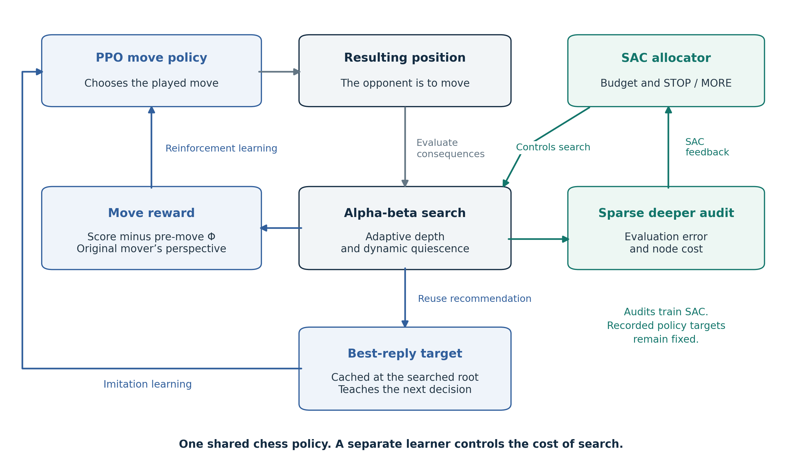

# EveryRoot
Chess Engine with Two Neural Networks that learn to play chess from adaptive search alphabeta with computational cost allocation

# EveryRoot

### Learning chess moves and search allocation

Chess engines have made extraordinary progress by combining position evaluation with the ability to calculate far ahead. EveryRoot investigates how more of that calculation can become knowledge the engine learns to use: knowledge of **which move to play**, and knowledge of **how much further calculation a position deserves**.

The idea is to connect these two learning problems. A PPO policy plays a move. An adaptive alpha-beta search evaluates the resulting position and supplies a reward for that decision. The completed search also recommends a reply, which becomes a teaching target when the same policy plays from that position. Alongside this, a separate SAC agent learns the initial search budget and when to stop or continue calculating.

**We want a chess engine that can compete on playing strength while requiring less computation.** The route is to learn from the tactical work search already performs, then learn to control the cost of producing that knowledge. If successful, this could support a faster, more affordable chess-playing and analysis app, as well as a learned allocation component for other search-based engines.

## The architecture is the contribution

An expensive search can do more than judge the last move. In EveryRoot, its completed result has two uses. Its score teaches the policy about the move just played; its best reply teaches the same shared policy what to play from the position actually searched. These are different decisions, and each signal is attached to its correct position and player.

The imitation target is recovered from an existing search. It does not require another teacher search, a separate policy forward pass, or an exhaustive set of scores for every legal move. The auxiliary loss adds a small amount of training work. This gives the system a more specific lesson than a scalar reward alone, while retaining the original reinforcement-learning objective.

SAC learns a different decision: whether another tranche of search is worth its computational cost. It uses the position and search telemetry, with sparse deeper continuations supplying feedback about evaluation error. Its training balances that error against node expenditure. Control gradually passes from a Stockfish-derived allocation teacher to the learned controller. Conventional alpha-beta pruning remains inside the search engine.

This is the research hypothesis: **learning the player and learning the effort spent teaching it can improve chess strength per unit of computation.** The contribution under investigation is their integration in this particular loop.

## Why this could matter for chess engines

| Design choice | What it enables | Benefit if successful |
| --- | --- | --- |
| Search-derived rewards for played moves | Tactical consequences become immediate policy feedback | Learn useful decisions from each judged move, without waiting for the game result |
| A best-reply target from the same completed search | Search supplies a concrete legal move to imitate at its own root | Make better use of calculation already paid for |
| Learned search budgets and stopping | Computation depends on the position and the progress of search | Preserve useful tactical analysis while reducing unnecessary work |
| A separate compute learner and sparse audits | Evaluate the allocator without rewriting recorded PPO rewards | Improve allocation while preserving the meaning of collected policy samples |
| Shared policy and asynchronous CPU/GPU execution | Both colours learn through one player while native searches overlap with policy work | Support continued self-play within a practical compute budget |

There are two worthwhile outcomes. The complete EveryRoot engine could combine learned play with adaptive calculation. The allocation component could also be adapted to a conventional engine that lets alpha-beta choose the move directly. That second application would require a suitable controller state and objective for the new engine; it is a development path, not an already demonstrated transfer.

## Where it fits in existing research

Learning from search has an established history. Expert Iteration separates planning from learning to generalise those plans, while AlphaZero combines self-play, a learned policy and value function, and tree search. EveryRoot builds on that broader idea using a policy-only clipped PPO objective, local alpha-beta rewards, cached best-move imitation, and a detached SAC allocation controller. [Expert Iteration](https://arxiv.org/abs/1705.08439), [AlphaZero](https://arxiv.org/abs/1712.01815), [PPO](https://arxiv.org/abs/1707.06347), [SAC](https://arxiv.org/abs/1801.01290).

Stockfish and Leela Chess Zero already combine sophisticated search with neural components in different ways. EveryRoot asks whether the effort of its alpha-beta teacher can itself be learned while the move policy learns from that teacher. It does not claim to have invented search learning, or to have replaced the branch-pruning rules of Stockfish. The implemented allocation teacher explicitly credits Stockfish's time-management work. [Stockfish time management](https://github.com/official-stockfish/Stockfish/blob/master/src/timeman.cpp), [Lc0 architecture](https://lczero.org/dev/wiki/technical-explanation-of-leela-chess-zero/).

## Development direction

The learning loop is implemented in a working research prototype. The programme aims to scale self-play towards **20 million games** and develop an engine whose playing strength justifies its computational cost. An approximately **18M-parameter** residual policy runs alongside native CPU search and a separate neural compute controller.

Stronger play at the same operating cost, or comparable play at lower cost, is the intended advance. Competitive superiority and compute savings are research objectives; this architecture note does not establish either result. The current policy learns from completed search results during training. It does not inspect a newly computed tree before making the move that generated that search.

## Read the research note

- [Architecture report, PDF](report/EveryRoot_Architecture_Report.pdf)
- [Architecture report, editable Markdown](docs/architecture_report.md)
- [References and attribution](REFERENCES.md)
- [GitHub and Zenodo publication instructions](PUBLISHING.md)
- [Citation metadata](CITATION.cff)

This repository contains the project description, architecture and publication materials. Engine source and trained weights are not part of this release. Prepared by **Pedro Teles**, September 2026. See [rights](RIGHTS.md).
